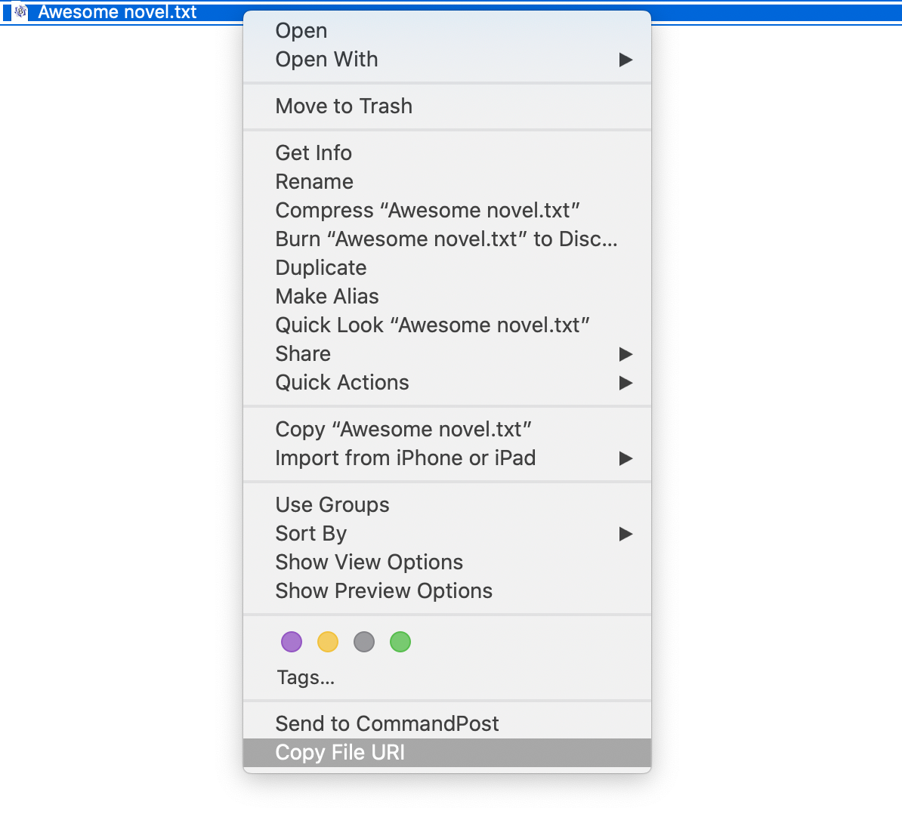

**Right-click a file or folder in the MacOS Finder.app — Save its complete path (a URI) to the clipboard to paste somewhere.**

## Uses

- Reference the location of something in a Word document, a Notion page, a wiki.
- Point someone to the correct folder.
- Clean and with spaces, no escape characters.

## Example

- Right-click on `Awesome novel.txt` on your Desktop.
- Select `Copy File URI` from the context menu.
  - at the very bottom
  - or inside the `Quick Actions` 
- Press `⌘ V` to paste `/Mac HD/Desktop/Awesome novel.txt`.

## How to Install

1. Download the `Copy File URI` service from the `Releases` to your home’s library (`~/Library/Services/`).
   - It's nothing fancy, just a folder with some XML and a [Bash script](bash_script/copy_file_or_folder_URI_on_right_click.sh).

## How to Tinker and Modify

1. Download the [Bash script](bash_script/copy_file_or_folder_URI_on_right_click.sh).
2. Open Automator:
    - Launch Automator, found in your Applications folder.
3. Select a `New Document`:
    - Choose to create a new document.
4. Choose `Service` or `Quick Action`:
    - Depending on your macOS version, create a `Service` (older versions) or a `Quick Action` (newer versions).
5. Service Receives Selected:
    - Set the service to `pass-through` selected `files or folders` in `Finder`.
6. Add Run Shell Script:
    - Drag the `Run Shell Script` action from the library to the workflow area.
    - Set `Pass input` to `as arguments`.
7. Copy-paste and modify the [Bash script](bash_script/copy_file_or_folder_URI_on_right_click.sh).
   - it contains inline comments for all the logic

Note: No `Finder.app` relaunching is required.
